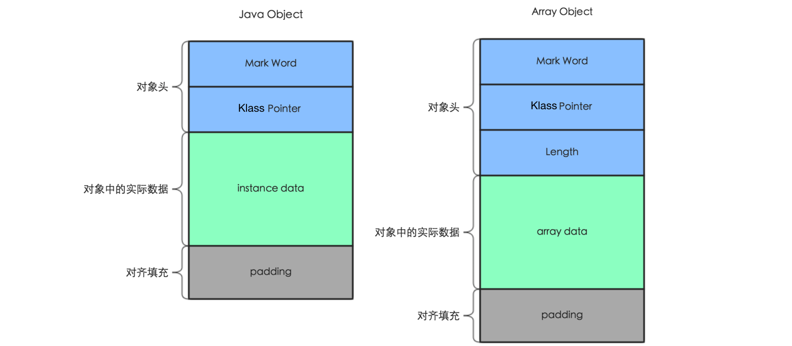

### 内存布局

一个Java对象在内存中包括*对象头*(Object Header)、*实例数据*(Instance Data)和*对齐填充*(Padding)3个部分[^1]:



对象头

* Mark Word：包含一系列的标记位，比如轻量级锁的标记位，偏向锁标记位等等。在32位系统占4字节，在64位系统中占8字节；
* Klass Pointer：用来指向对象对应的Klass对象(其对应的元数据对象）的内存地址。在32位系统占4字节，在64位系统中占8字节；
* Length：如果是数组对象，还有一个保存数组长度的空间，占4个字节；

例如你有一个Person实例的引用，那么找到元数据就靠它了[^4]:


对象实际数据

* `byte`, `boolean`: 1字节
* `short`, `char`: 2字节
* `int`, `float`: 4字节
* `long`, `double`: 8字节
* reference: 4字节

对齐填充

* 对象占用字节数必须是8的倍数

#### 压缩

64位HotSpot JVM支持压缩，可以使用`-XX:+UseCompressedOops`开启(默认开启)。开启后，Klass Pointer占用4个字节。例如下面是包装类型的对象大小：

| Numberic Wrappers | +useCompressedOops | -useCompressedOops |
| ----------------- | ------------------ | ------------------ |
| Byte, Boolean     | 16 bytes           | 24 bytes           |
| Short, Character  | 16 bytes           | 24 bytes           |
| Integer, Float    | 16 bytes           | 24 bytes           |
| Long, Double      | 24 bytes           | 24 bytes           |

查看对象大小以及布局的工具有很多，其中一种较为方便的是[jol](https://openjdk.java.net/projects/code-tools/jol/)，其具体使用方法如下：

=== "ObjectSize"

```java
public class ObjectSize {
    int a;
    long b;
    static int c;
    public static void main(String[] args) {
        ObjectSize testObjectSize = new ObjectSize();
        System.out.println(ClassLayout.parseInstance(testObjectSize).toPrintable());
    }
}
```

=== "Output"

```text
// 前面2个object header是Mark Word, 后面一个是Klass Pointer
 OFFSET  SIZE   TYPE DESCRIPTION                               VALUE
      0     4        (object header)                           01 00 00 00 (00000001 00000000 00000000 00000000) (1)
      4     4        (object header)                           00 00 00 00 (00000000 00000000 00000000 00000000) (0)
      8     4        (object header)                           05 c1 00 f8 (00000101 11000001 00000000 11111000) (-134168315)
     12     4    int ObjectSize.a                              0
     16     8   long ObjectSize.b                              0
Instance size: 24 bytes
Space losses: 0 bytes internal + 0 bytes external = 0 bytes total
```

### OOP-Klass

OOP-Klass Model用来表示Java对象。

* OOP是指Ordinary Object Pointer(普通对象指针)，用来表示对象的实例信息
* Klass包含元数据和方法信息，用来描述Java类

在Java程序运行的过程中，每创建一个新的对象，在JVM内部就会相应地创建一个对应类型的oop对象。各种oop类的共同基类为`oopDesc`类[^2]。

```cpp
class oopDesc {
private:

  volatile markOop  _mark; // mark word
  union _metadata { // 元数据
    // 实例对应的 Klass （实例对应的类）的指针
    Klass*      _klass;
    // 压缩指针
    narrowKlass _compressed_klass;
  } _metadata;
```

#### Mark Word

Mark Word的结构如下所示：


[^1]: http://www.ideabuffer.cn/2017/05/06/Java对象内存布局/
[^2]: https://www.sczyh30.com/posts/Java/jvm-klass-oop/

[^3]: 深入理解Java虚拟机. 周志明
[^4]: https://juejin.im/post/5e830f546fb9a03c341d9346